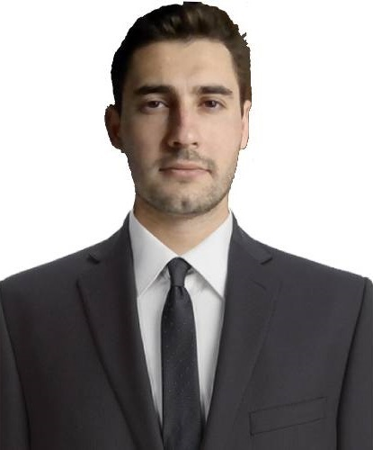

#
# Available Languages

#
# Personal Information:

    

* Name and Surname: Ahmet Fatih YEGEN
* Year of Birth: 1996
* Gender male
* Marital Status: Single
* Address: Huzur Mh. Seyrantepe - Sarıyer/Istanbul - TURKEY
* Phone Number: +90 505 034 0009
* Email Address: fatihyegen.09@gmail.com

#
# Educational Information:

### 42 Istanbul
* Currently Studying
* Field: Software Engineering
* Technologies: C-lang, BASH and 42 projects.

### Pamukkale University
* Diploma: Electric and Electronics Engineering
* Graduation Year: 2020
* Field: Faculty of Engineering
* Academic Average: 3.14/4

### Warsaw University Of Technology
* Erasmus 2 Term
* GPA: 70
* Fields: 
    * Faculty of Electrical Engineering 
    * Faculty of Electronics and Information Technology

#
# Work Experience:

### Surat Cargo
     Software Developer Stack
     I am currently interested in this stack. 

     Want to continue my journey with, 
     LLM API's (LLM API's for DB control, query and so.), 
     Robotics, anything including; improving our daily lives.
* Position: Software Development Specialist
* Working Period: 1 Year 1 Months
* Technologies Used and Responsibilities:
     * .NET Core/Framework
         * Entity Framework, (SEN APP DEVELOPMENT)
             * Tables -> Scaffolding and Migration basic LinQ Queries
             * Data Annotation and Fluent api (SQL Table design improvement)
         * MVC Razor pages, bootstrap (SURATKARGO.COM)
             * Page: SEN Points (Trader Cargo Franchises Page),
             * Page: Adding page for displaying executives.
         * N Architecture built on ONION architecture Domain Driven Design,(SEN DEVELOPMENT)
         * Testing and creating pages for Blazor WebAsm for new programs in Future.
         * N Architecture - MVC project
             * Page: Added Cargo Points DB 
                 * SQL Query creation (SQL injection safe)
                 * JS libraries: sorting and downloading excel files using .NET jquery.datatables.js and xlsx.js 
             * Page: Added Company Telephone Numbers
                 * Page creation with Bootstrap
                 * jQuery: Dynamically getting personal info or personal info for create/update Telephone Numbers 
                 * Page: Comparison of yesterdays Personels with today to get where is the SIM located.
                 * Page: Apply Changes To Numbers: Comparison of yesterdays and Todays Personel then mass update them.

     * JavaScript
         * React ABP(React .Net BoilerPlate)
             * Page: Creation and the design of HR, Promotion Hierarchy related pages.
                 * Simplifiying Front-End codes and creating backend components in Entity Framework DDD architecture.
             * Page Renovation: Adding new components: Info page, getting cargo summaries for cargo distribution points.
                 * Changing the backend API's for faster queries and database connection. Creating effective SQL queries.
             * Page Renovation: Hierarchy Delegate addition, ABP boilerplate new API and new Front-end additions.  
         * React Native
             * Adding Barcode Scanning Libraries and a page for scanning Datamatrix and old type barcodes.
         * Nextjs
             * Creating a page for EPL(barcode-HTML) view page for requesting eplprinter website for different json datasets for testing for to see barcode design fails.
     * PowerShell
         * Automating of adding old projects to git repos by folder.
     * WSL: Ubuntu
         * Finding similarities of different BARCODE EPL's using bash commands.
         For creating a simplified and common BARCODE creation.

         EPL (Eltron Programming Language; HTML-SVG for barcode)
* Summary:
     * Designing, developing, and maintaining NET-based web applications.
     * Database design and management, data access using Entity Framework.
     * Frontend development, creating user interfaces using JavaScript libraries (React, ReactNative).
     * Designing and developing RESTful APIs, utilizing ASP.NET Web API.
     * Implementing best practices and design patterns to enhance code quality and performance.

### Alpler Ziraat Aletleri A.Ş.
###
     Automation Stack. 
     I am interested to this stack if; 
     Coding and R&D involved.

* Position: Automation and Maintenance Development Engineer
* Working Period: 10 Months
* Technologies: ISPsoft, WPLsoft, DOPSoft. Automation Projects. Electronics, Pipe and Instrumentation diagrams, Electrical Schematics..
* Summary: Repairs, Automation and schematics
     * A long session of personal development history. Ask for more information.

### OTHERS
* Engineer Intern - Ugur Deep Freezers I.C. Aydin, Turkey
* ARGE Research Intern - HAUS(Hakki Usta) Santrifuge Technologies Aydin, Turkey

...

# Software Abilities and Skills:
* Programming Languages:
    * .NET Framework/Core
         * Entity Framework
         * MVC Razor Pages
         * Onion Architecture
         * Blazor WebAssembly
         * ABP Framework
         * N Architecture
    * JavaScript
         * React 
         * React Native
         * Next.js
         * jQuery
    * PowerShell
    * WSL (Ubuntu, Kali)
    * Web Development:
         * HTML
         * CSS
         * JavaScript
         * React
         * SCSS-SASS
         * ReactMarkdown
         * D3.js - Fiber
         * Three.js

     * Backend Development and APIs:
         * MongoDB
         * BASH
         * Express.js
         * Node.js
         * Puppeteer

     * ORM(Object Relational Mapping):
         * Entity Framework
         * Prisma

     * Databases:
         * Relational Databases
             * MSSQL, POSTGRE, MySQL, SQLite
         * No-SQL:
             * MongoDB

     * Frontend Dev.
         * Javascript, JQuery, React, RNative, Next
         * Redux, React Query, Zustand, Mobx

     * Python:
         * Django, django-htmx, django-unicorn,
         * Libs: pygame, tkinter, pyautogui, pynput, selenium, pyinstaller, numpy

    * Mobile Development:
        * React Native: Android & IOS
        * CapacitorJS

     * Others:
         * Git
         * GitHub
         * Regex
         * BASH
         * PowerShell

* Software Development Tools and Frameworks:
     * Visual Studio 2022
     * Visual Studio Code
     * SQL Server Management Studio
     * Azure Data Studio

* Testing and Debug Techniques:
     * Pentesting
     * Performance

To Github of mine. https://github.com/fygen

# References
* Ask about semi supervised machine learning project I did in Optimisation Techniques [Pr. Dr. Serdar Iplikçi at Pamukkale University on Linkedin.](https://www.linkedin.com/in/serdar-iplikci-71900928/?originalSubdomain=tr)

* About our studies mail to Head Of Dpt.[ Prof. Dr. Abdullah Tahsin Tola at PAU](mailto:attola@pau.edu.tr)

* [A project made for Marmara University](https://www.youtube.com/watch?v=OYWDSDwgbp8&ab_channel=AhmetYegen)

* 2 year old React CV Template Website Created from ground up dependencies: https://fygen.github.io/ 
    * Source codes at: https://github.com/fygen/theCVproject

* Sürat Kargo 
    * [Serdar Demirtaş Senior Software Developer](https://www.linkedin.com/in/serdardemirtas/),
    * [Süleyman İzgi Senior Software Developer](https://www.linkedin.com/in/suleyman-izgi-b49a4687/) ... 

* Any Company I worked for above.

# Certificates

* [Backend Dev. & API's](https://www.freecodecamp.org/certification/fygen/back-end-development-and-apis "FreeCodeCamp Certification")

* [Relational Databases](https://www.freecodecamp.org/certification/fygen/relational-database-v8 "FreeCodeCamp Certification")

* [Front End Development Libraries](https://www.freecodecamp.org/certification/fygen/front-end-development-libraries "FreeCodeCamp Certification")

* [JavaScript Al. & Data Str.](https://www.freecodecamp.org/certification/fygen/javascript-algorithms-and-data-structures "FreeCodeCamp Certification")

* [Resp. Web Design](https://www.freecodecamp.org/certification/fygen/responsive-web-design "FreeCodeCamp Certification")

* [Python Md. L](https://www.udemy.com/certificate/UC-f09f7667-0bd5-4a78-9df0-1d659ef8785e/ "Udemy Md. Python Certification")